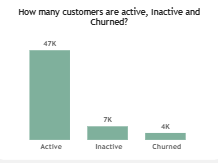
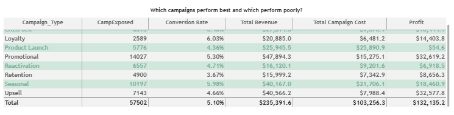
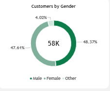
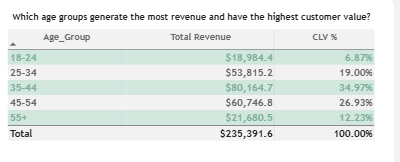
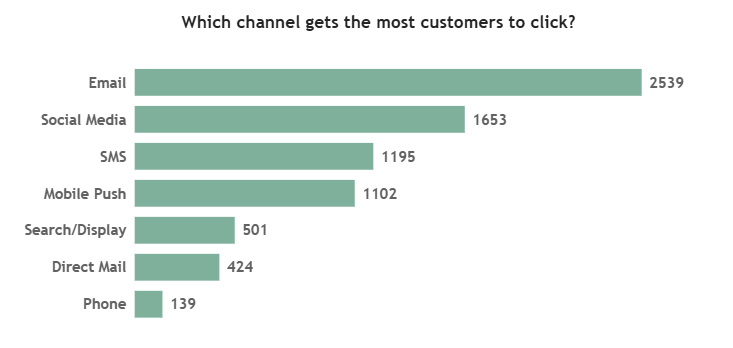

# Marketing-Campaign-Analysis

Unlocking Insights: Insight Mark marketing campaign analysis.

---

## Introduction
Insight Mark is facing a growing challenge despite investing heavily in marketing campaigns, the company lacks a clear understanding of which customers are most valuable, which campaigns drive results, and which channels generate meaningful engagement and purchases. Customer churn, inconsistent campaign performance, and differences in customer spending make it difficult to know where marketing resources should be focused.
To address these challenges, this project analyses 57,502 customer records across 43 variables, covering customer demographics, purchasing behaviour, customer value, campaign engagement, costs, revenue, and customer status.

---

## About the Dataset
The dataset provided is a synthetic collection of customer records from Insight Mark Company spanning 2024 to 2026. It includes information on approximately 57,502 customer records, offering insights into various aspects of marketing campaign. Below are key details about the dataset:
Scope: Synthetic data of 57,502 customer records from Insight Mark Company.
Timeframe: covers marketing campaign from 2024 to 2026.
Content: includes detailed information on customer demographics, purchase frequency, historical revenue, customer churn and retention, CLV.
File Type: CSV
Structure: consists of a single table.
Dataset: Marketing Campaign.

---

## Data Analysis and Visualization
The dataset was first cleaned and standardized using SQL, where inconsistencies were addressed and the data was structured for analysis. Additional analytical fields, including age groups, were also created in SQL to support customer segmentation and deeper analysis.
The prepared dataset was then imported into Power BI, where the analysis and visualization was developed. Power BI was used to identify customer and campaign trends, evaluate performance, and transform the cleaned data into an interactive dashboard that supports data-driven business insights.

---

## Data Cleaning and Transformation
To prepare the dataset for analysis, important cleaning and transformation steps were carried out to ensure consistency and usability. The following steps were the actions carried out:
Created a replica of the main table using SQL to avoid data deletion and to preserve the original data.
Standardize Column Formats and Trimmed Extra Spaces: As part of the data cleaning process, the data was standardized to ensure consistency and accuracy throughout the analysis. This included using a consistent date format, standardizing text capitalization, and correcting numerical data types. Unnecessary spaces in column names and data entries were also removed to reduce matching errors, duplicate values, and inconsistencies, making the dataset cleaner and more reliable for analysis.
Created Customer Age Groups using SQL: An Age Group column was created to group customers into predefined age ranges. This makes it easier to compare customer behaviour across different age groups and identify demographic patterns, preferences, and trends that may be useful for targeted marketing and customer engagement.
Created a Discount Usage Band using DAX: A Discount Usage Band was created to categorize customers based on how frequently they used discounts. Customers were grouped into Low, Medium, and High Usage categories, making it easier to understand.

---
## Key Findings

Analysis of customer records from Insight Mark marketing campaign spanning 2024 to 2026 reveals several critical data points:
57,502 Customer records involving 12K unique customers
A historical revenue of $36.8M
A retention rate of 93.69% and a churn rate of 6.31%
Financially, Insight Mark generated $235.4K in revenue while incurring a total campaign cost of $103.3K during the period analysed. Customers recorded an average order value of $75.78, while the average customer lifetime value (CLV) was $1.24K, indicating that customers generated significantly more value over their relationship with the business than from a single purchase. Overall, the results suggest that Insight Mark was able to generate substantial revenue from its marketing investment, while the CLV highlights the importance of retaining customers and encouraging repeat purchases to maximize long-term value.

---

## Analysis Questions and Insights
Several key insights emerge from this dataset:

1. How many customers are active, inactive and churned?

  
   
  The analysis shows that the customer base is generally in a good position, with about 47,000 customers remaining fully active. However, around 7,000 customers are currently inactive, which could be a warning sign if they continue to disengage. There are also about 4,000 customers who have already churned, meaning the business has lost a noticeable portion of its customer base. This highlights the need to understand why customers are becoming inactive or leaving and to introduce timely engagement strategies that can bring them back before they churn.

2. Which customer segments generate the most Revenue?

   The analysis shows that High Value customers bring in the most revenue, contributing about $66K, while Premium customers generate around $53K. This suggests that these higher-value customers play an important role in the company's overall revenue. Keeping these customers satisfied and engaged should therefore be a priority, as losing them could have a noticeable impact on business performance. At the same time, there is an opportunity to understand what makes High Value customers spend more and use those insights to increase the value of Premium customers.

3. Which gender has a higher campaign engagement and Purchasing Activity?

   Analysis shows that male customers recorded slightly higher purchasing activity, generating about $136K, compared with $124K from female customers. Despite this difference in spending, both groups showed a similar level of campaign engagement, suggesting that the campaigns are reaching male and female customers relatively equally. The higher purchasing activi4ty among male customers may indicate an opportunity to better understand what drives their spending and apply similar strategies to encourage higher purchases among female customers.

4. Which campaign performs best and which performs poorly?

   The analysis shows that Upsell was the most efficient campaign, generating $32,577 in profit from a relatively low cost of $7,988. It also achieved a 4.66% conversion rate from 7,143 customer exposures, demonstrating strong cost efficiency and customer engagement. 
In contrast, Product Launch performed poorly, spending $25,890 but generating only $54 in profit. Despite having a similar conversion rate of 4.36%, its higher cost and lower exposure of 5,776 customers resulted in very poor returns. Overall, the findings show that high campaign spending and conversion rates do not necessarily lead to profitability. Campaigns should therefore be evaluated based on their cost efficiency, conversion, and profit generated.

## Other Findings
1. Customer Demographics
   Gender Distribution: Male(48.37%), Female(47.61%), Others(4.02%)

 
   
  Age Groups By Customer Value: Customers aged 35–44 are the most valuable segment, generating $80,164 in revenue and accounting for 34.97% of total customer value. In contrast, the 18–24 age group contributes only $18,984 in revenue, representing 6.87% of customer value. This suggests that purchasing power and overall customer value increase significantly with age, making the 35–44 segment a key target for revenue growth and customer retention strategies.

2. Top-Performing Campaigns by Purchases

 

   The analysis indicates that promotional campaigns are the strongest sales driver, generating approximately $58K in sales, followed by seasonal campaigns at $52K. This suggests that customers respond more strongly to promotional offers, making them a potentially effective strategy for driving sales and increasing overall campaign performance.

3. Most Engaging Marketing Channels?

 

   The analysis shows that Email is the most engaging marketing channel, with 2,539 customer interactions, followed by Social Media with 1,653 and SMS with 1,195. This indicates that Email has the strongest reach and customer participation, making it the most effective channel for engaging customers in campaigns.

4. Customer Spending and Purchase Behaviour

 

   The analysis shows that Premium Customers are the most frequent purchasers, with an average of 17.26 purchases and an average historical revenue of $2,686.58. They also have the highest Average Order Value (AOV) at $157.20, indicating stronger and more frequent spending behavior. High-Value Customers follow, averaging 11.24 purchases and generating approximately $1,209.06 in historical revenue, with an AOV of $107.90. Overall, Premium Customers demonstrate the strongest combination of purchase frequency and spending value, making them a particularly important segment for retention and loyalty strategies.

---

## Strategic Recommendations for Insight Mark

Based on the insights from the provided dataset, here are my top 3 recommendations that address key challenges and opportunities for Insight Mark:

1.  Prioritize Premium and High-Value customers: These customers demonstrate the strongest purchasing behavior, with higher purchase frequency, revenue, average order value (AOV), and customer lifetime value (CLV) than other segments. This indicates that they already contribute significantly to the business and have strong potential to generate continued revenue. Insight Mark should therefore focus on retaining these customers through personalized offers and targeted retention campaigns. The priority should not simply be to encourage more purchases, but to prevent churn and strengthen long-term customer relationships, ultimately increasing the lifetime value of these high-value customers.

2. Develop a strategy for New and At-Risk customers: These groups currently show lower campaign response and purchase rates compared with Premium and High-Value customers, suggesting that broad campaigns may not be effective for them. Insight Mark should therefore use onboarding campaigns for new customers to build engagement and encourage repeat purchases, while re-engagement campaigns should be used to reconnect with At-Risk customers before they become inactive. Monitoring indicators such as days since last purchase and churn risk can help identify customers who need timely intervention. This approach allows marketing efforts to be more relevant to each customer's stage and behavior, rather than applying the same strategy across all segments.
   
3. Reduce dependence on heavy discounts: The analysis shows that customers with higher historical discount usage tend to generate lower average revenue, suggesting that frequent or larger discounts do not necessarily lead to more valuable customers. Instead of broadly increasing discount levels, Insight Mark should test personalized offers based on customer behavior, purchase history, and value. This can help the business maintain customer engagement while protecting revenue and reducing unnecessary discount costs.

---

## Assumptions & Caveats

### Assumptions:

i. Each record represents a customer-campaign interaction, with Customer ID used to identify individual customers.
ii. Purchase After Campaign > 0 is treated as evidence that a customer made a purchase after the campaign.
iii. Historical Revenue is used to measure customer spending and behavior, while Net Revenue is used for campaign-related revenue.
iv. Customer Status accurately reflects the customer's current status for retention and churn analysis.
v. Campaign engagement measures such as exposure, opens, clicks, and conversions are assumed to be recorded consistently across campaigns.

### Caveats/Limitations

i. Campaign costs may be duplicated across customer-level records, which could overstate campaign costs and affect profit calculations.
ii. Campaign profitability should be interpreted cautiously until costs are validated at the Campaign ID level.
iii. The analysis identifies relationships rather than causation; for example, higher discount usage does not prove that discounts cause lower spending.
iv. Campaign performance may be affected by customer segments, targeting, and exposure levels, making direct comparisons potentially misleading.
v. The analysis is limited to the available data and time period and does not account for external factors such as competition, seasonality, economic conditions, or pricing changes.

---

## Conclusion
The analysis shows that Insight Mark has a strong base of high-value customers, but campaign performance and customer engagement can still be improved. Premium and High-Value customers contribute strongly to customer value and campaign response, while lower-value and at-risk customers present opportunities for targeted retention. Overall, the findings suggest that Insight Mark should focus on personalized targeting, stronger campaign and channel selection, and reducing reliance on broad discounting to improve marketing effectiveness and long-term customer value.
